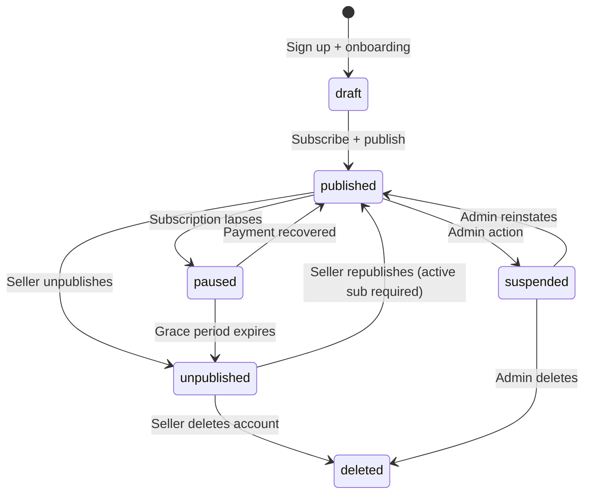

# Nomi Publish-Gated SaaS Model — Product Architecture Proposal

**Classification:** Internal product strategy  
**Author:** Product Architecture Review  
**Status:** Proposal  
**Date:** July 2026

---

## Executive Summary

Nomi adopts a **Build Free, Publish Paid** model. Sellers build their entire storefront — products, branding, fulfillment, payments — without spending a cent. The paywall appears only at the moment the seller decides to go live. This aligns payment with value: you pay when Nomi starts making you money.

> Build your dream storefront for free.  
> Pay only when you're ready to start selling.

---

## 1. Product Journey

```
Landing Page          "What is this?"
     ↓
Sign Up               "Let me try it."
     ↓
Onboarding            "This is easy."
     ↓
Build Mode            "I'm making this mine."
     ↓
Store Completion      "This actually looks professional."
     ↓
Publish Decision      "I'm ready to launch."
     ↓
Subscription          "Worth it."
     ↓
Live Store            "I have a real business."
     ↓
First Order           "This works."
```

### Why each stage exists

| Stage | Purpose | Emotional goal |
|:------|:--------|:---------------|
| **Landing Page** | Communicate the value proposition in under 10 seconds | Curiosity → "This is different from Linktree" |
| **Sign Up** | Lowest possible friction entry — Google OAuth, no credit card | Commitment without risk |
| **Onboarding** | Guided 7-step wizard that produces a real storefront skeleton | Early dopamine — "I already have something" |
| **Build Mode** | Unlimited time to perfect the store — products, hero, vibe, fulfillment | Ownership — "This is MY store" |
| **Store Completion** | Dashboard signals when the store meets the publish threshold | Confidence — "I've done everything right" |
| **Publish Decision** | Seller-initiated. Never auto-prompted or nagged | Agency — "I choose to launch" |
| **Subscription** | Clean, one-screen plan selection + payment | Trust — "Fair price, clear terms" |
| **Live Store** | Instant. Store URL becomes publicly accessible within seconds | Celebration — "It's real" |
| **First Order** | The ultimate proof of value | Validation — "This was worth it" |

**Key principle:** The seller must feel they received enormous value *before* being asked to pay. By the time they see the pricing screen, they've already built something they're proud of.

---

## 2. Build Mode — Free Tier Definition

### Must Be Free (Non-Negotiable)

These features define the build experience. Restricting any of them would break the seller's ability to evaluate whether Nomi is right for them.

| Feature | Reasoning |
|:--------|:----------|
| Account creation | Zero-friction entry is the growth engine |
| Full onboarding wizard | The 7-step flow produces the store skeleton — it IS the product demo |
| Dashboard access | Sellers need the full management interface to understand Nomi's value |
| Unlimited products | Artificial product limits feel punitive and create anxiety about plan tiers |
| All vibe themes | Restricting vibes to paid tiers would make free stores look intentionally ugly — destroys trust |
| Hero/branding customization | The store must look premium in Build Mode or sellers won't believe it will look premium when published |
| Fulfillment configuration | Sellers need to configure pickup/delivery to understand the full order flow |
| PayNow setup | Payment configuration is part of readiness — locking it creates a chicken-and-egg problem |
| Logo upload | Core brand identity — gating this makes Build Mode feel crippled |
| Category management | Required for catalog organization |
| Store preview (private) | The seller must see exactly what buyers will see before committing to pay |

### Should Be Free

| Feature | Reasoning |
|:--------|:----------|
| Test checkout (self-order) | Sellers should be able to walk through the entire buyer experience to build confidence |
| QR code preview | Seeing the PayNow QR with their own details creates an "it's real" moment |
| Mobile preview | Most sellers will share links on WhatsApp/Instagram — they need to see how it looks on a phone |
| Order management UI (empty state) | Showing the orders dashboard (empty) lets sellers envision the future |

### Could Be Limited

| Feature | Possible limit | Reasoning |
|:--------|:---------------|:----------|
| Product images | Limit storage (e.g., 50MB) but not count | Prevents abuse without affecting most small sellers |
| Analytics | Basic page views only; detailed analytics on paid | Sellers don't need analytics until they have traffic |
| Custom domain | Paid only | Vanity feature — the `.nomi.sg` subdomain is sufficient for most |

### Must Require Publishing (Paid)

| Feature | Reasoning |
|:--------|:----------|
| Public storefront URL | This IS the paywall. The store exists but isn't accessible to buyers |
| Receiving real orders | Orders require a published store — this is the core value exchange |
| Search engine indexing | Draft stores must not be indexable |
| Social sharing (working links) | Shared links for unpublished stores show a "Coming Soon" page |
| PWA install prompt for buyers | Only published stores offer the install experience |

### The Golden Rule

> If removing a free feature would make the seller less confident about publishing, it must remain free.

The Build Mode exists to create conviction. Every restriction that undermines conviction reduces conversion to paid.

---

## 3. The Publish Gate

This is the most important UX moment in Nomi's entire product. It is the conversion event. Every design decision must serve one goal: **make the seller feel ready, excited, and confident when they press Publish.**

### When Should the Publish Button Appear?

**Always visible, but contextually gated.**

The Publish action should be discoverable from Day 1 in the dashboard. It should NOT be hidden behind a feature flag or revealed only after completion. Hiding it creates anxiety ("Where do I publish?") and removes the aspirational pull.

However, the button's state changes based on readiness:

| Store state | Button appearance | Behavior |
|:------------|:-----------------|:---------|
| Missing critical items | "Publish" — disabled, with checklist tooltip | Shows what's still needed |
| All items complete | "Publish Your Store" — enabled, primary emphasis | Opens the publish flow |
| Already published | "Published ✓" — success state | Links to store management |

### Should Publishing Require 100% Readiness?

**Yes, but define "readiness" minimally.**

The readiness checklist must only contain items that would cause a broken buyer experience if missing:

1. ✓ Store name set
2. ✓ Subdomain claimed
3. ✓ Vibe selected
4. ✓ Hero configured (at minimum: store title)
5. ✓ At least 1 active product
6. ✓ Fulfillment configured (pickup or delivery)
7. ✓ PayNow configured

Items that are *nice to have* but NOT required:
- Logo upload (monogram auto-generates)
- Product images (text-only cards still work)
- Hero subheading (optional field)
- Multiple products (one is enough)
- Both fulfillment methods (one is enough)

**Rationale:** A buyer visiting a published store with one product, no logo, and pickup-only fulfillment will still have a functional, professional-looking shopping experience. The vibe system guarantees visual quality regardless of content density.

### Should We Warn About Missing Items?

**Yes — as helpful guidance, never as blocking errors.**

The publish flow should show a "Store Health" summary:

```
Ready to publish ✓

Your store has:
  ✓ 12 products across 3 categories
  ✓ Pickup + Delivery configured
  ✓ PayNow verified
  
Suggestions (optional):
  ○ Add a logo for stronger brand recognition
  ○ Write a hero subheading to tell customers what you offer
  ○ Add images to 4 products that don't have them yet
```

Suggestions are clearly labeled as optional. They do not block publishing. They give the seller confidence that they've been thorough.

### The Emotional Experience of Pressing Publish

This must feel like **launching a business**, not paying a software bill.

**The publish flow should be a 3-screen ceremony:**

**Screen 1 — "Your store is ready"**
- Show a mini-preview of the storefront (the existing `MiniPreview` component)
- Display the public URL they'll receive
- Show the readiness checklist (all green)
- Primary CTA: "Choose Your Plan"

**Screen 2 — "Choose your plan"**
- Clean plan comparison (see §4)
- No dark patterns, no "most popular" manipulation
- Simple value communication
- Primary CTA: "Subscribe & Publish"

**Screen 3 — "Your store is live 🎉"**
- Confetti or celebration animation
- The live URL, tappable
- "Copy Link" + "Share on WhatsApp" + "Open Store" buttons
- "Go to Dashboard" as secondary action
- This screen must feel like an achievement

**What it must NOT feel like:**
- A checkout page for software
- A paywall blocking something they've already built
- A bait-and-switch after free onboarding
- A subscription trap with hidden terms

---

## 4. Billing Flow

### Recommended Sequence

```
Seller taps "Publish Your Store"
          ↓
   Store Health Summary
   (readiness confirmation)
          ↓
     Plan Selection
   (choose Starter or Pro)
          ↓
     Payment Entry
   (Stripe Checkout or embedded)
          ↓
  Payment Confirmed → Store status: Published
          ↓
   "Your Store is Live 🎉"
   (celebration + sharing tools)
```

### Why This Order

**Publish intent comes first.** The seller has already decided they want to go live. The plan selection and payment are mechanical steps between their decision and the result. Asking them to choose a plan *before* they've decided to publish inverts the emotional sequence — it makes the plan feel like a prerequisite rather than a formality.

**Payment is the last barrier before the reward.** The celebration screen appears immediately after successful payment. No additional steps, no "setting up your store" loading screen. The store should be live within seconds.

### Plan Structure (Recommendation)

Two plans. No free tier confusion. No enterprise tier complexity.

| | **Starter** | **Pro** |
|:--|:------------|:--------|
| **Price** | S$9/month | S$19/month |
| **Annual** | S$7/month (billed S$84/yr) | S$15/month (billed S$180/yr) |
| **Products** | Unlimited | Unlimited |
| **Orders** | Unlimited | Unlimited |
| **Vibes** | All | All |
| **Custom domain** | — | ✓ |
| **Analytics** | Basic (views, orders) | Detailed (conversion, sources, trends) |
| **Priority support** | — | ✓ |
| **Remove "Powered by Nomi"** | — | ✓ |
| **Multiple stores** | 1 | Up to 3 |

**Pricing rationale:**
- S$9/month is below the psychological threshold for SG side hustlers. It's less than a meal at a hawker center.
- S$19/month is justified by the "professional" positioning — custom domain alone is worth it for serious sellers.
- Annual discount incentivizes commitment and reduces churn.
- No product/order limits on any tier. Artificial scarcity creates resentment.

### Payment Provider

**Stripe** is the recommended billing provider:
- Native SG support (SGD)
- Subscription management (upgrade, downgrade, cancel)
- Invoice generation
- Webhook-driven status updates
- PCI-compliant card handling
- No PayNow for subscriptions (ironic, but Stripe handles recurring billing; PayNow is for the seller's customers)

### Trial Period

**No free trial.** 

The entire Build Mode IS the trial. The seller has already used the product extensively before seeing a price. A 14-day trial after they've spent weeks building would feel arbitrary and create urgency anxiety. The publish gate is a more honest model: use it free forever, pay when you want to go live.

---

## 5. Store Status Architecture

### Status Definitions

| Status | Description | Owner access | Public access | Search indexing | Direct URL |
|:-------|:------------|:-------------|:--------------|:----------------|:-----------|
| **`draft`** | Store exists but has never been published. Seller is building. | Full dashboard + private preview | ✗ Shows "Coming Soon" page | ✗ `noindex` | "Coming Soon" with store name |
| **`published`** | Active subscription. Store is live. | Full dashboard + live store | ✓ Full storefront | ✓ Indexable | ✓ Full storefront |
| **`paused`** | Subscription lapsed (grace period). Store temporarily offline. | Full dashboard + private preview | ✗ Shows "Temporarily Unavailable" | ✗ `noindex` | "Temporarily Unavailable" |
| **`unpublished`** | Seller voluntarily took store offline. Subscription may still be active. | Full dashboard + private preview | ✗ Shows "Store Closed" | ✗ `noindex` | "Store Closed" page |
| **`suspended`** | Admin action (ToS violation, fraud). | Read-only dashboard | ✗ Shows "Store Unavailable" | ✗ `noindex` | "Store Unavailable" |
| **`deleted`** | Soft delete. Data retained for 30 days. | ✗ No access | ✗ 404 | ✗ | ✗ 404 |

### Status Transitions



### Key Rules

1. **Owner can ALWAYS preview.** Regardless of status, the store owner can view their storefront via a private preview URL (`/s/[slug]?preview=true` with auth check). This is essential for building confidence before (re)publishing.

2. **Public visitors see status-appropriate pages.** Never a raw 404 or error page. Always a branded Nomi page that communicates what's happening.

3. **`paused` is automatic and reversible.** When a subscription payment fails, the store enters `paused` with a 7-day grace period. The seller sees a banner in their dashboard: "Your subscription payment failed. Update your payment method to keep your store live." If payment is recovered (Stripe retry or manual update), the store automatically returns to `published`.

4. **`unpublished` preserves everything.** All products, orders, configuration, and analytics data are retained. The seller can republish at any time by reactivating their subscription. This supports seasonal businesses and sellers who want to rebuild privately.

5. **Slug is reserved permanently.** Once claimed, a slug belongs to that seller regardless of store status. This prevents domain squatting and ensures social media links remain valid if the seller republishes.

### "Coming Soon" Page (Draft Stores)

When a buyer visits a draft store's URL, they should see:

```
[Store Name]

This store is coming soon.

Built with Nomi — create your own storefront at nomi.sg
```

This serves two purposes:
- The seller can share their link early ("My store is coming soon!") for social proof
- It drives organic traffic to Nomi's landing page

---

## 6. Dashboard Experience Evolution

The dashboard should feel different at each stage of the seller's journey. Not through restructuring — the navigation (Home, Orders, Products, Storefront, Settings) remains constant — but through what's emphasized, what's visible, and what guidance is offered.

### Stage 1 — Building (Draft, No Subscription)

**Home dashboard emphasis:** Store readiness.

| Element | Behavior |
|:--------|:---------|
| **Hero banner** | "Your store is taking shape" — progress indicator toward publish-readiness |
| **Readiness checklist** | Prominent card showing 5/7 steps complete (interactive, links to each section) |
| **Store preview card** | Live mini-preview of the storefront, updating in real-time as they make changes |
| **Publish CTA** | Visible but secondary. Becomes primary when checklist is 100% |
| **Orders section** | Empty state: "Orders will appear here once your store is published" |
| **Analytics** | Hidden or minimal — no data to show yet |
| **Tip cards** | Contextual suggestions: "Add product images to increase buyer confidence" |

**Emotional tone:** Encouraging, guiding, building momentum.

### Stage 2 — Ready to Publish (Draft, Checklist Complete)

**Home dashboard emphasis:** The publish moment.

| Element | Behavior |
|:--------|:---------|
| **Hero banner** | "Your store is ready to launch" — celebratory tone with confetti dots |
| **Readiness checklist** | All green. Shows "100% ready" with a subtle animation |
| **Publish CTA** | Primary position, full-width, high-emphasis: "Publish Your Store →" |
| **Store preview card** | Larger, more prominent — "This is what your customers will see" |
| **Comparison nudge** | Optional: "Join 500+ SG sellers already on Nomi" (social proof, only if true) |

**Emotional tone:** Confident, celebratory, "you've earned this."

### Stage 3 — Just Published (Published, 0 Orders)

**Home dashboard emphasis:** Sharing and first actions.

| Element | Behavior |
|:--------|:---------|
| **Hero banner** | "Your store is live! 🎉" — with the public URL and copy/share buttons |
| **Quick actions** | "Share on WhatsApp" · "Copy Link" · "Post on Instagram" · "Install PWA" |
| **Store preview card** | Now shows the LIVE store (link opens in new tab) |
| **Orders section** | Empty state changes to: "Waiting for your first order..." with a subtle pulse |
| **Getting started tips** | "Share your link in your Instagram bio" · "Post your store on your Telegram channel" |
| **Subscription status** | Small, unobtrusive badge: "Starter Plan · Active" |

**Emotional tone:** Exciting, action-oriented, "go tell the world."

### Stage 4 — Active Business (Published, Has Orders)

**Home dashboard emphasis:** Business metrics and management.

| Element | Behavior |
|:--------|:---------|
| **Hero banner** | Replaced by metrics row: Today's orders · Revenue this week · Pending orders |
| **Recent orders** | List of the last 5 orders with status badges |
| **Quick actions** | "View Orders" · "Add Product" · "Preview Store" |
| **Analytics summary** | Page views, conversion rate, top products (Pro plan shows more detail) |
| **Tips** | Contextual: "Your best seller is [X] — consider featuring it" |

**Emotional tone:** Professional, business-like, "you're running a real operation."

### Subscription Status Indicators

The subscription status should be visible but never anxiety-inducing:

| State | Indicator |
|:------|:----------|
| Active | Small green dot + "Starter Plan" in settings, nowhere else |
| Payment failing | Yellow banner at top of dashboard: "Payment issue — update your card to keep your store live" |
| Grace period (paused) | Red banner: "Your store is offline. Update payment to republish." |
| Cancelled (future) | Info banner: "Your plan ends on [date]. Your store will go offline after that." |

---

## 7. Edge Cases

### Subscription Expires (Payment Failure)

**Timeline:**
1. **Day 0:** Payment fails. Stripe retries automatically.
2. **Day 0–3:** Store remains `published`. Seller sees a yellow warning banner in dashboard. Email notification sent.
3. **Day 3:** Second retry fails. Another email. Banner turns orange.
4. **Day 7:** Final retry fails. Store status changes to `paused`. Seller receives email: "Your store is now offline."
5. **Day 7–30:** Store shows "Temporarily Unavailable" to visitors. Seller can update payment at any time to instantly republish.
6. **Day 30:** If no payment recovery, store moves to `unpublished`. All data preserved. Seller can republish later with a new subscription.

**Key principle:** Never delete data. Never punish. Always provide a clear path back.

### Seller Cancels Subscription

**Immediate:** Nothing changes. The store remains published until the current billing period ends.

**End of period:** Store status changes to `unpublished`. The seller sees:

> "Your store is now offline. Your products, orders, and settings are all saved. You can republish anytime by reactivating your subscription."

**Data retention:** Indefinite for account holders. Only soft-deleted accounts purge after 30 days.

### Seller Republishes After Cancellation

1. Seller opens dashboard → sees "Republish" CTA
2. Taps "Republish" → taken to plan selection (their previous plan is pre-selected)
3. Enters payment → store immediately returns to `published`
4. All products, orders, analytics, and configuration are exactly as they left them
5. The public URL works again instantly (no DNS delay since it's a subdomain)

**Experience:** Frictionless return. It should take under 60 seconds.

### Seller Wants to Rebuild Privately

The seller is published but wants to make major changes (new vibe, restructure catalog) without customers seeing a half-finished store.

**Recommendation:** "Maintenance Mode" — a toggle in Settings.

When enabled:
- Store shows a branded "Be right back" page to public visitors
- Owner can still preview the full store via authenticated preview
- Subscription continues (the seller is still paying; they just want privacy)
- Toggle off → store is instantly live again with all changes

This is distinct from `unpublished` because the subscription remains active and the intent is temporary.

### Seller Downgrades (Pro → Starter)

**At renewal:** The plan changes. Pro features (custom domain, detailed analytics, "Powered by Nomi" removal) are disabled.

**Graceful degradation:**
- Custom domain stops resolving → subdomain still works
- Analytics view reverts to basic
- "Powered by Nomi" badge reappears
- Multiple stores beyond 1 become `paused` (seller chooses which one stays active)

**No data loss.** If they upgrade again, everything returns.

### Seller Pauses Their Business (Seasonal)

Some sellers (e.g., CNY cookie sellers, Christmas market vendors) operate seasonally.

**Recommendation:** Allow subscription cancellation with easy republishing. Do NOT offer a "pause subscription" feature — it adds billing complexity. Instead:

1. Seller cancels subscription
2. Store goes offline at end of period
3. When season returns, seller reactivates with one tap
4. Store is instantly live with all previous configuration

The "easy republish" flow described above handles this naturally.

---

## 8. System Architecture

### High-Level Boundaries

```
┌─────────────────────────────────────────────────────┐
│                    NOMI PLATFORM                     │
├──────────────────────┬──────────────────────────────┤
│   BUILD LAYER        │   PUBLISH LAYER              │
│   (Always Free)      │   (Subscription Required)    │
│                      │                              │
│   • Auth + Account   │   • Public storefront URL    │
│   • Dashboard        │   • Order processing         │
│   • Product CRUD     │   • Buyer-facing checkout    │
│   • Vibe selection   │   • Payment (PayNow) flow    │
│   • Hero config      │   • Order notifications      │
│   • Fulfillment cfg  │   • Search engine indexing   │
│   • PayNow setup     │   • Social link resolution   │
│   • Private preview  │   • PWA install prompt       │
│   • Image upload     │   • Analytics (live data)    │
│                      │                              │
├──────────────────────┴──────────────────────────────┤
│                 BILLING BOUNDARY                     │
│                                                      │
│   Stripe Subscriptions                               │
│   • Webhook-driven status sync                       │
│   • Grace period management                          │
│   • Plan upgrade/downgrade                           │
│   • Invoice + receipt generation                     │
└──────────────────────────────────────────────────────┘
```

### Visibility & Routing

| Request type | Draft | Published | Paused | Unpublished |
|:-------------|:------|:----------|:-------|:------------|
| `GET /s/[slug]` (public) | "Coming Soon" page | Full storefront | "Temporarily Unavailable" | "Store Closed" |
| `GET /s/[slug]?preview=true` (owner, authed) | Full storefront preview | Full storefront | Full storefront preview | Full storefront preview |
| `POST /s/[slug]/checkout` | 403 | ✓ Process order | 403 | 403 |
| `GET /s/[slug]/order/[ref]` | 403 | ✓ Order status | ✓ Order status (existing orders) | ✓ Order status (existing orders) |

### Subscription ↔ Store Status Sync

The store's `status` column is the single source of truth for visibility. Billing state maps to store status via webhook handlers:

```
Stripe Event                    →  Store Status
─────────────────────────────────────────────────
checkout.session.completed      →  published
invoice.paid (renewal)          →  published (no-op if already)
invoice.payment_failed          →  (no change; Stripe retries)
customer.subscription.deleted   →  unpublished
customer.subscription.paused    →  paused
```

A background job runs daily to handle grace period expiry:
- Stores in `paused` for > 30 days → `unpublished`

### Authentication & Authorization

| Action | Auth required | Additional check |
|:-------|:-------------|:-----------------|
| View published store | No | Store status = `published` |
| Preview draft store | Yes (owner) | `owner_id = auth.uid()` |
| Manage products | Yes (owner) | `owner_id = auth.uid()` |
| Publish store | Yes (owner) | Active subscription |
| Place order (buyer) | No | Store status = `published` |
| View order status | No | Valid order reference URL |
| Manage orders (seller) | Yes (owner) | `owner_id = auth.uid()` |

### Data Model Addition

The existing `stores` table needs one new column:

```sql
alter table public.stores
  add column subscription_id text,           -- Stripe subscription ID
  add column subscription_status text,       -- 'active', 'past_due', 'canceled', 'paused'
  add column subscription_plan text,         -- 'starter', 'pro'
  add column subscription_period_end timestamptz;  -- current period end date
```

Store `status` remains the routing/visibility control. `subscription_*` columns are billing metadata synced from Stripe webhooks.

---

## 9. UX Principles

### 1. Trust Through Transparency

The seller should never discover the paywall by surprise. The pricing model should be visible on the landing page, during onboarding, and in the dashboard — but never as a blocker, always as context.

**Landing page:** "Free to build. Plans start at S$9/month when you publish."  
**Onboarding:** No mention of pricing. Let the product speak.  
**Dashboard (building):** Subtle footer: "Free while you build · Plans start at S$9/month"  
**Publish flow:** Full plan comparison with clear pricing.

### 2. Simplicity Over Optionality

Two plans. Monthly or annual. No add-ons, no per-feature pricing, no usage-based billing. The seller should understand their cost in under 5 seconds.

### 3. Progressive Disclosure

Information appears when relevant:
- During Build Mode: focus on building, not billing
- At publish-readiness: introduce plans
- After publishing: focus on orders and growth
- At renewal: subtle confirmation, not a sales pitch

### 4. Seller Confidence

Every interaction should increase the seller's belief that their store is professional and ready for customers. The dashboard should never make them feel behind, inadequate, or pressured.

**Do:** "Your store has 12 products — that's more than most sellers start with!"  
**Don't:** "Upgrade to Pro to unlock analytics and grow faster!"

### 5. Momentum Preservation

Never interrupt the seller's flow with billing concerns. If they're in the middle of adding products, don't pop up a plan comparison. If they're editing their hero, don't show a subscription banner.

Billing conversations happen only when the seller initiates them (by tapping Publish or visiting Settings → Billing).

### 6. First-Time Entrepreneur Empathy

Many Nomi sellers have never run a business before. The platform should feel like a supportive partner, not a vendor.

**Language:** "Your store" not "your account." "Publish" not "activate." "Plan" not "subscription." "Go live" not "upgrade."

**Tone:** Encouraging, never transactional. Celebrate milestones. Acknowledge effort.

---

## 10. Success Metrics

How we know this model is working:

| Metric | Target | Why it matters |
|:-------|:-------|:---------------|
| **Sign-up to first product** | > 70% within 24 hours | Build Mode is engaging enough to retain |
| **Build Mode to publish-ready** | > 40% within 14 days | Sellers are completing their stores |
| **Publish-ready to published** | > 60% within 7 days | The paywall isn't blocking motivated sellers |
| **Published to first order** | > 50% within 14 days | Published stores are actually being shared |
| **Month-1 churn** | < 8% | Sellers who publish find ongoing value |
| **Month-3 retention** | > 75% | The product is sticky beyond initial excitement |
| **Average Build Mode duration** | 7–21 days | Sellers take enough time to build confidence, not so long they lose interest |

### Anti-Metrics (What We Must NOT Optimize For)

- **Conversion speed.** Rushing sellers to publish before they're ready increases churn.
- **Dark pattern conversion.** Tricking sellers into paying reduces LTV and creates negative word-of-mouth.
- **Feature gating in Build Mode.** Every feature locked behind the paywall is a seller who never discovers they'd pay for the full product.

---

## Appendix: Competitive Positioning

| Platform | Model | Why Nomi is different |
|:---------|:------|:---------------------|
| **Shopify** | 3-day trial → paid | Sellers pay before they know if the product works for them |
| **Carrd** | Free with limits → paid | Free tier looks intentionally crippled (Carrd branding, limited features) |
| **Linktree** | Freemium | Not a storefront — it's a link list. No commerce, no checkout |
| **Gumroad** | Transaction fees | No subscription, but 10% take rate on every sale adds up fast |
| **Nomi** | Build free, publish paid | Full product access during build. Fixed monthly cost. Zero transaction fees. |

Nomi's model is uniquely honest: the seller knows exactly what they're getting for free (everything except going live) and exactly what they're paying for (the ability to receive customers and orders). There is no degraded free experience. There is no surprise at checkout. There is no transaction tax eating into margins.

---

*This proposal defines the product strategy for Nomi's next milestone. Implementation details (Stripe integration, webhook handlers, migration plan) should be designed in a separate engineering specification after this proposal is approved.*
